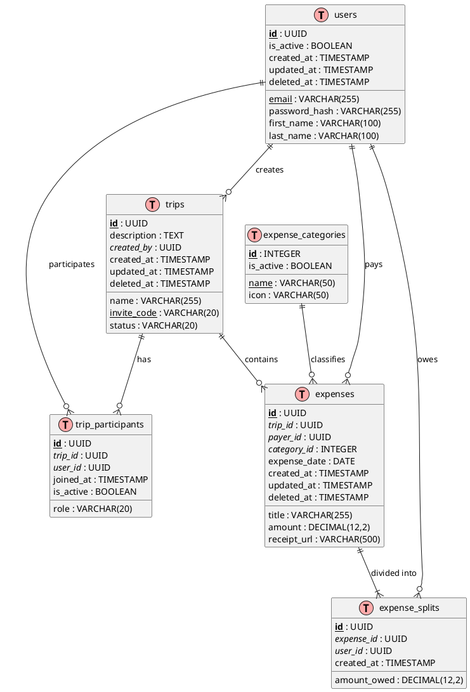

# ER Validation and Diagram Generation

## Purpose

Validate the data model (from either Extraction or Design mode) and generate the final ER diagram in PlantUML format. This sub-agent ensures the model meets quality standards and produces a correctly formatted, renderable diagram.

---

## Input Requirements

This sub-agent accepts input from either:

- **Extraction Mode:** Entity Summary from `@er-code-extractor.md`
- **Design Mode:** Model Design from `@er-model-designer.md`

Both inputs should contain:
- Entities with columns and types
- Primary keys
- Foreign keys
- Relationships

---

## Validation Process

### Phase 1: Structural Validation

#### 1.1 Primary Key Validation

| Check | Severity | Rule |
|-------|----------|------|
| PK Exists | ERROR | Every entity must have a primary key |
| PK Type | WARNING | UUID or SERIAL recommended |
| PK Naming | INFO | Should be named `id` |

#### 1.2 Foreign Key Validation

| Check | Severity | Rule |
|-------|----------|------|
| FK Target Exists | ERROR | Referenced table must exist |
| FK Column Exists | ERROR | Referenced column must be PK |
| FK Naming | WARNING | Should follow `{table}_id` pattern |
| FK Index | INFO | FK columns should be indexed |

#### 1.3 Relationship Validation

| Check | Severity | Rule |
|-------|----------|------|
| Both Sides Defined | WARNING | 1:N should have FK on N side |
| M:N Has Junction | ERROR | M:N must have junction table |
| Cardinality Consistent | ERROR | Both sides must agree |
| No Orphan Tables | WARNING | All tables should be connected |

### Phase 2: Normalization Validation

#### 2.1 First Normal Form (1NF)

| Check | Severity | Violation Example |
|-------|----------|-------------------|
| Atomic Values | ERROR | `tags VARCHAR` containing CSV |
| No Arrays | ERROR | `items TEXT[]` without join table |
| Unique Rows | ERROR | Missing primary key |

#### 2.2 Second Normal Form (2NF)

| Check | Severity | Violation Example |
|-------|----------|-------------------|
| No Partial Deps | ERROR | Non-key depends on part of composite PK |

#### 2.3 Third Normal Form (3NF)

| Check | Severity | Violation Example |
|-------|----------|-------------------|
| No Transitive Deps | WARNING | `city` depends on `zip_code`, not PK |

### Phase 3: Naming Convention Validation

| Element | Convention | Example |
|---------|------------|---------|
| Table Name | snake_case, plural | `users`, `trip_participants` |
| Column Name | snake_case | `created_at`, `user_id` |
| PK Name | `id` | `id` |
| FK Name | `{table_singular}_id` | `user_id`, `trip_id` |
| Junction Table | `{entity1}_{entity2}s` | `trip_participants` |

### Phase 4: Data Type Validation

| Concept | Expected Type | Warning If |
|---------|---------------|------------|
| ID | UUID or SERIAL | Using VARCHAR for ID |
| Email | VARCHAR(255) | Too short (< 100) |
| Name | VARCHAR(100-255) | Using TEXT |
| Description | TEXT | Using VARCHAR |
| Money | DECIMAL(12,2) | Using FLOAT |
| Status | VARCHAR(20) | Using TEXT |
| Timestamp | TIMESTAMP | Using VARCHAR |
| Boolean | BOOLEAN | Using INTEGER |

---

## Validation Report Format

Generate a validation report:

```yaml
validation_report:
  timestamp: "2026-01-15T12:00:00Z"
  mode: "DESIGN"  # or "EXTRACTION"
  source: "docs/PRD.md"  # or code path
  
  summary:
    total_entities: 6
    total_relationships: 8
    errors: 0
    warnings: 2
    info: 5
  
  entities_validated:
    - name: "User"
      status: "VALID"
      checks:
        - check: "Primary Key"
          status: "PASS"
        - check: "Naming Convention"
          status: "PASS"
    
    - name: "Trip"
      status: "VALID"
      checks:
        - check: "Primary Key"
          status: "PASS"
        - check: "Foreign Keys"
          status: "PASS"
          details: "created_by -> users(id)"
  
  normalization:
    level: "3NF"
    violations: []
    notes:
      - "All entities comply with 3NF"
  
  issues:
    errors: []
    warnings:
      - entity: "ExpenseCategory"
        issue: "No soft delete column (deleted_at)"
        suggestion: "Add deleted_at TIMESTAMP NULLABLE"
    info:
      - entity: "User"
        issue: "email column could benefit from index"
        suggestion: "CREATE INDEX idx_users_email ON users(email)"
```

---

## Diagram Generation

### PlantUML ER Diagram Format

Generate the diagram using PlantUML IE (Information Engineering) notation:



### Cardinality Notation

| Notation | Meaning | Description |
|----------|---------|-------------|
| `\|\|` | One (mandatory) | Exactly one |
| `\|o` | Zero or one | Optional one |
| `o{` | Zero or many | Optional many |
| `\|{` | One or many | At least one |
| `--` | Relationship line | Connects entities |

### Relationship Examples

```plantuml
' One-to-One (mandatory both sides)
entity1 ||--|| entity2 : "has"

' One-to-One (optional on one side)
entity1 ||--o| entity2 : "may have"

' One-to-Many (mandatory one, optional many)
entity1 ||--o{ entity2 : "contains"

' One-to-Many (mandatory both sides)
entity1 ||--|{ entity2 : "must have"

' Many-to-Many (through junction)
entity1 ||--o{ junction : "participates"
entity2 ||--o{ junction : "includes"
```

---

## Output Files

### 1. ER Diagram File

**Location:** `docs/diagrams/er/01-er-diagram.puml`

The main PlantUML diagram file.

### 2. Validation Report (Optional)

If requested, generate a markdown report:

**Location:** `docs/diagrams/er/ER-VALIDATION-REPORT.md`

```markdown
# ER Model Validation Report

## Summary
- **Mode:** DESIGN
- **Source:** docs/PRD.md
- **Generated:** 2026-01-15
- **Normalization Level:** 3NF

## Entities (6)
| Entity | Status | PK | FKs | Issues |
|--------|--------|----|----|--------|
| users | VALID | id (UUID) | - | None |
| trips | VALID | id (UUID) | created_by | None |
...

## Relationships (8)
| From | To | Type | FK Column |
|------|-----|------|-----------|
| users | trips | 1:N | created_by |
...

## Normalization Analysis
- **1NF:** COMPLIANT
- **2NF:** COMPLIANT
- **3NF:** COMPLIANT

## Recommendations
1. Add index on `users.email` for login performance
2. Consider partitioning `expenses` by `trip_id` for large datasets
```

---

## Syntax Validation Rules

### PlantUML Syntax Checks

| Rule | Correct | Incorrect |
|------|---------|-----------|
| @startuml name | `@startuml er-diagram` | `@startuml ER Diagram` |
| Lowercase names | `@startuml er-diagram` | `@startuml ER-Diagram` |
| No spaces in name | `er-diagram` | `er diagram` |
| Entity definition | `entity name { }` | `table name { }` |
| Relationship | `e1 \|\|--o{ e2 : "label"` | `e1 -> e2` |

### Common Syntax Errors to Avoid

```plantuml
' WRONG: Spaces in @startuml name
@startuml ER Diagram

' CORRECT: Kebab-case, no spaces
@startuml er-diagram

' WRONG: Using -> for relationships
users -> trips

' CORRECT: Using proper cardinality notation
users ||--o{ trips : "creates"

' WRONG: Missing relationship label
users ||--o{ trips

' CORRECT: Include relationship label
users ||--o{ trips : "creates"
```



---

## Rendering Test

After generating the diagram, verify it renders correctly:

1. **PlantUML Online Server:** http://www.plantuml.com/plantuml/uml/
2. **VS Code Extension:** PlantUML extension preview
3. **Command Line:** `plantuml docs/diagrams/er/01-er-diagram.puml`

---

## Validation Checkpoints

Before finalizing output:

- [ ] All entities have PK defined
- [ ] All FK references exist
- [ ] All relationships have both sides
- [ ] Cardinality notation is correct
- [ ] PlantUML syntax is valid
- [ ] @startuml uses kebab-case lowercase
- [ ] All relationship lines have labels
- [ ] Diagram renders without errors
- [ ] Validation report is complete (if requested)

---

## Error Handling

| Scenario | Action |
|----------|--------|
| Missing PK | Add ERROR to report, block diagram |
| Invalid FK reference | Add ERROR to report, exclude relationship |
| Syntax error | Fix automatically if possible, warn if not |
| Rendering failure | Provide manual fix suggestions |
| Normalization violation | Add to report with severity and suggestion |
