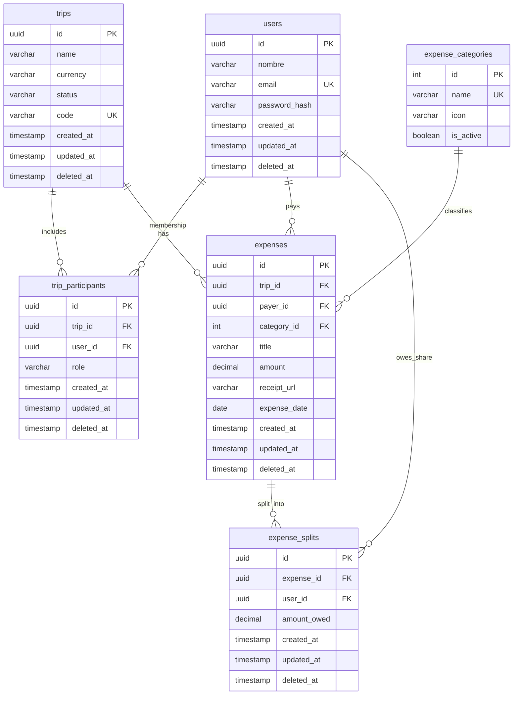

# TravelSplit – Core Data Model and Entity-Relationship Diagram

## Scope and sources of truth

- **ORM:** TypeORM (`Backend/src/modules/**/entities/*.entity.ts`).
- **Migrations:** TypeScript migration classes under `Backend/src/migrations/` (PostgreSQL DDL generated by TypeORM; there is no `schema.prisma` or standalone `.sql` migration folder in this repository).
- **Out of scope for the ERD:** TypeORM’s `migrations` metadata table (framework-owned).

The domain contains **six physical tables** that model the core trip/expense workflow. All are included below (under the ten-entity limit).

## Core entities (summary)

| Table | Description |
|-------|-------------|
| `users` | Application user (credentials and profile fields). |
| `trips` | Trip/workspace with currency, status, and invite `code`. |
| `trip_participants` | Association between `users` and `trips` with contextual `role` (e.g. creator vs member). Unique pair `(trip_id, user_id)`. |
| `expense_categories` | Lookup of expense categories (integer PK; does not use the shared `BaseEntity` pattern). |
| `expenses` | Expense line for a trip: payer, category, amount, date, optional receipt. |
| `expense_splits` | Per-user share of an expense (`amount_owed`) for settlement logic. |

Shared columns on entities extending `BaseEntity`: `id` (UUID), `created_at`, `updated_at`, `deleted_at` (soft delete), except `expense_categories` which only has its own primary key and columns.

## Cardinalities (business view)

- **User ↔ Trip:** **Many-to-many**, implemented via **`trip_participants`** (each row is one membership with a `role`).
- **Trip → Expense:** **One-to-many** (each expense belongs to exactly one trip).
- **User → Expense (as payer):** **One-to-many** (`payer_id`).
- **ExpenseCategory → Expense:** **One-to-many** (`category_id`; delete restricted if expenses exist).
- **Expense → ExpenseSplit:** **One-to-many** (splits partition or allocate the expense across users).
- **User → ExpenseSplit:** **One-to-many** (`user_id` = beneficiary / person who owes that split).

## Entity-relationship diagram (Mermaid)

### How to read the diagram

- `||--o{` reads as **one** on the left side **to zero or more** on the right (one-to-many from the perspective of the left entity).
- **User–Trip many-to-many** appears as two one-to-many legs into `trip_participants`, constrained so each `(trip_id, user_id)` pair is unique at the database level.

## Referential actions (from entities)

- `trip_participants.trip_id` → `trips.id`: **CASCADE** on delete.
- `trip_participants.user_id` → `users.id`: **CASCADE** on delete.
- `expenses.trip_id` → `trips.id`: **CASCADE** on delete.
- `expenses.payer_id` → `users.id`: **CASCADE** on delete.
- `expenses.category_id` → `expense_categories.id`: **RESTRICT** on delete.
- `expense_splits.expense_id` → `expenses.id`: **CASCADE** on delete.
- `expense_splits.user_id` → `users.id`: **CASCADE** on delete.

## Related documentation

- Data dictionary and indexing notes (if present): `docs/data-dictionary.md`, `docs/data-model-indexing-audit.md`.
- Migration authoring: `Backend/src/migrations/README.md`.
